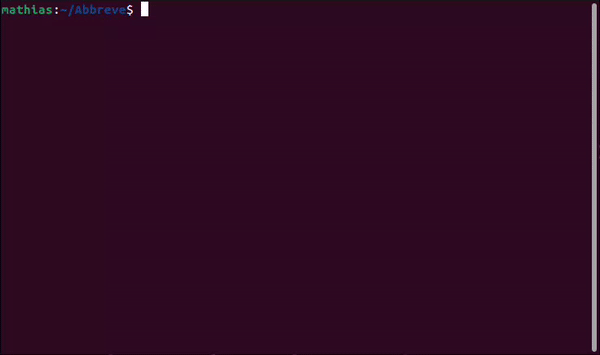

<div id="header" align="center">
  <br>
    <h1> Abbreve </h1>
    <p><strong><em>"Elevate your language game, decode the slang with ease"</em></strong></p>
    <!-- to change tagline if necessary -->
    </div> <br>

# :tada: Welcome to Abbreve

+ With the increasing use of online communication, it can be difficult to keep up with the ever-changing shorthand and jargon used in digital conversations. Enter **Abbreve** 
+ Abbreve solves this problem by providing definitions for these abbreviations with just a search, making it easy for you to understand and participate in online conversations with confidence.
+ Abbreve is an open-source dictionary for slang. With Abbreve, you'll never have to feel left out of a conversation or unsure of the meaning of an abbreviation again.
+ The dictionary is constantly updated with new slang and abbreviations, so you can always stay current with the latest internet lingo.

<div id="centertext" align="center">
    <h3>Abbreve can be used by anyone, from casual internet users to professionals!</h3>
</div>

# :movie_camera: Project Overview

You can check out the live project [here](https://www.abbreve.tech/)

All you need to do is start entering a slang in the search bar, and the meaning will be provided. Below the main meaning of the slang could be alternative meanings.


# :mega: Want to contribute?

We would love to have you! Abbreve is open source and we are keen on hearing what you have to say. Do check out the [code of conduct](https://github.com/Njong392/Abbreve/blob/main/CODE_OF_CONDUCT.md) for rules and guidelines, and our [CONTRIBUTING.md file](https://github.com/Njong392/Abbreve/blob/main/CONTRIBUTING.md) for any steps you might need.

## :bulb: Getting Started

Found a bug? Accessibility issue? Or do you want to add an abbreviation to our database? Then go right ahead and create an issue.

### Tech Stack

This project uses:

- [React](https://reactjs.org/)
- [TailwindCSS](https://tailwindcss.com)

### Prerequisites

Before installation, you need to have the following:

- [Node](https://nodejs.org) installed
- Basic knowledge of [Git](https://git-scm.com/)

### Steps

1. [Fork](https://github.com/Njong392/Abbreve/fork) this repository.
2. In your terminal, clone your fork using `git clone <link to your fork>`.
3. Run `cd Abbreve` to navigate to project directory.
4. Run `npm ci` to add node_modules folder. 
> Running `npm ci` instead of `npm install` reduces the possibility of making unwarranted changes to the `package-lock.json` and `package.json` files. Check the difference and advantages on the [npm docs](https://docs.npmjs.com/cli/v9/commands/npm-ci)
5. To start the server on localhost, run `npm run dev`.

>This project uses [Vite](https://vitejs.dev), but that shouldn't overwhelm you. Everything works pretty much the same.

6. Make your changes, push your code, and open a pull request.

### Adding an Abbreviation

Before adding an abbreviation, please make sure that the new entry does not already exist. You can easily check this by entering the slang on the [live](https://abbreve.tech) site to see if it gives a result or not.

> For now, we use [JSON](https://www.w3schools.com/js/js_json_intro.asp) to store the abbreviations. We hope to improve on this as time goes on.

We provide two ways for adding new abbreviations.  
[1. Manually adding in the `db` directory](#1-manually-adding-in-the-db-directory)  
[2. Using the CLI](#2-using-the-cli)

### 1. Manually adding in the `db` directory

This option requires you to manually create definition files in the `public/server/db` directory.
Follow the steps below to manually add an abbreviation

1. In the `/public` folder, open the `/server` folder and subsequently, the `/db` folder you find in it. You can see that each slang is a JSON file of its own.

2. To add a new abbreviation, you must create a new file.
    - The file name should be the slang you want to add. For example, `lgtm.json` is the file for the slang `lgtm`
    - The file name must be in lowercase. For example, `lgtm.json` not `LGTM.json`

3. Inside the file you created, create a new object to store the defintion of the slang, and/or alternative definitions. Taking `lgtm` as an example again,

    ```JSON
    {
        "definition": "Looks Good To Me",
        "alternatives": "Looks Great To Me, Looks Great To Merge"
    }
    ```

    `definition` is the most common abbreviation for the slang, and `alternatives` is/are other ways people use the slang.

4. As you can see above, the first letter of each word in both `definition` and `alternatives` is uppercase.

5. If a slang does not have alternatives, add only a `definition`. For example, in the `asap.json` file for the slang `asap`,

    ```JSON
    {
        "definition": "As Soon As Possible"
    }
    ```

    > :information_source: If you encounter any issues with the file naming, kindly use the [CLI option](#2-using-the-cli) instead

### 2. Using the CLI

Using our CLI to add slang is very easy, as it handles all file naming issues and also validates the definitions to ensure that they follow our [naming conventions](#warning-important-naming-conventions).  
Follow the steps below to add new slang using our CLI

1. From your terminal, run the `db:entry` script. E.g `npm run db:entry`
2. Choose the first option (`Add a new abbreviation`)
    > :bulb: You can choose an option using your up/down arrow keys
3. Input the abbreviation you want to add and press `Enter`
4. After your input, another question pops up, asking if you have alternative definitions. If you do, press `y`, followed by `Enter`. If the slang does not have any alternative definition, press `n` then `Enter`.
   > If you have other alternatives, enter the alternative and press `Enter` to add. When you are done add *all* your alternatives, press `Enter` without entering anything else
   >
   > :information_source: When adding multiple alternatives, do not separate them with a comma like you would do when manually entering into db. Instead, press `Enter` after each alternative entry until you are done with all your entries.
5. If you have other slang to add, press `y` and repeat from step 1. Else, press `n` and then `Enter`.
6. Review your changes in the `public/server/db` directory

> If you encounter any error whiles using the CLI, kindly report it [here](https://github.com/Njong392/Abbreve/issues/new)

The GIF below demonstrates how to use the CLI to add new abbreviations



### :warning: **IMPORTANT** Naming Conventions

Before pushing your changes, please check and ensure that all your additions follow the naming conventions listed below:

* The slang must be in lowercase. For example, `lol` and **not** `Lol` or `LOL`
* The first letter of each word in the definition and alternatives **must** be *capitalized*. For example, `Looks Good To Me` and **not** `Looks good to me` or `looks good to me`

> Only English slang are accepted as of yet.

:bomb: Now, GO CREATE THOSE ISSUES AND PULL REQUESTS!

# :key: License

This project is licensed with [Apache-2.0 License](https://github.com/Njong392/Abbreve/blob/main/LICENSE.md).

If you like the [project](https://www.abbreve.tech/), Don't forget to leave a star :star: . All support is highly appreciated :100:
